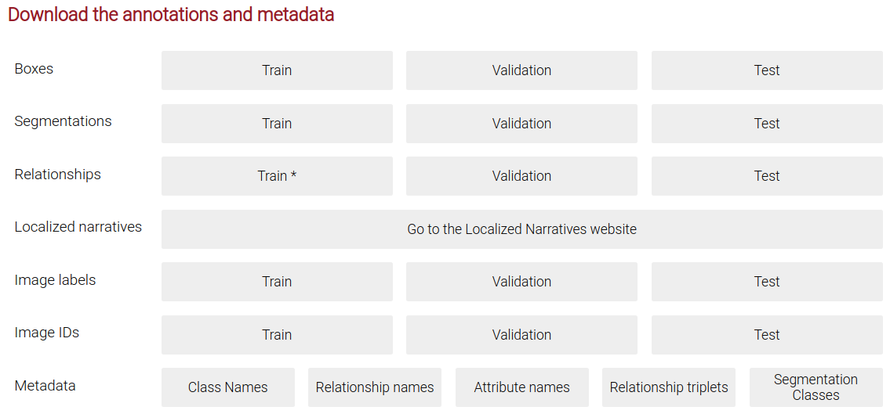
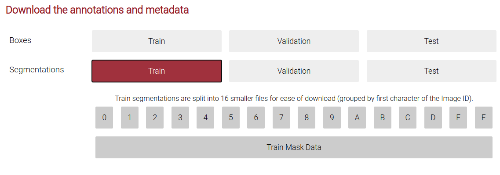

# Open Images Dataset V6
So far there are scripts just for segmentation but will be adding for bbox soon...

## Directory Structure
```
.OID_V6
├── csv
│   ├── class-descriptions-boxable.csv
│   ├── m0gxl3_annotations.csv
│   └── train-annotations-object-segmentation.csv
├── downloader_IDs_for_m0gxl3_train.txt
├── downloader.py
├── images
│   ├── test
│   ├── train
│   └── validation
├── masks
│   ├── test
│   ├── train
│   └── val
└── split_id_and_annotation_per_label.py 
```

# Download per class label: images & annotations from OID_V6
### Setup
The [official documentation](https://storage.googleapis.com/openimages/web/download.html) offers `downloader.py` as a way to download a subset of images. 

Install `downloader.py` from website and then install requirements
```
mkvirtualenv OID_V6 -p python3 #(Optional but good practice)
pip install openimages
```

### Get Class Names

Before anything download by clicking under <b>Metadata -> Class Names</b>. This yields `class-descriptions-boxable.csv`. Inspect file, place it under csv folder, and write down your class name label, e.g. `/m/0gxl`, which represents handgun.

### Get Segmentation Images and Masks


There is no way to selectively download the masks per label so download every number-letter. Then for every number-letter, e.g. #3,
```
cd masks/train
unzip -j ~/Downloads/train-masks-3.zip  #-j allows to unzip content directly (ignores zip folder name)
```
Then download by clicking under <b>Train Mask Data</b>. This yields `train-annotations-object-segmentation.csv`. Place it under csv folder.

Generate the list of images per label that `downloader.py` requires by (run from base directory)
```
python split_id_and_annotation_per_label.py --label "/m/0gxl3" --subset train --input csv/train-annotations-object-segmentation.csv
```
This script will generate a `downloader_IDs_for_m0gxl3_train.txt` and a filtered `m0gxl3_annotations.csv` for convenience.

Selectively download images per label (run from base directory)
```
mkdir images/train/handgun_m0gxl3/
python downloader.py downloader_IDs_for_m0gxl3_train.txt --download_folder=images/train/handgun_m0gxl3/ --num_processes=5
```

Repeat process for validation and test.